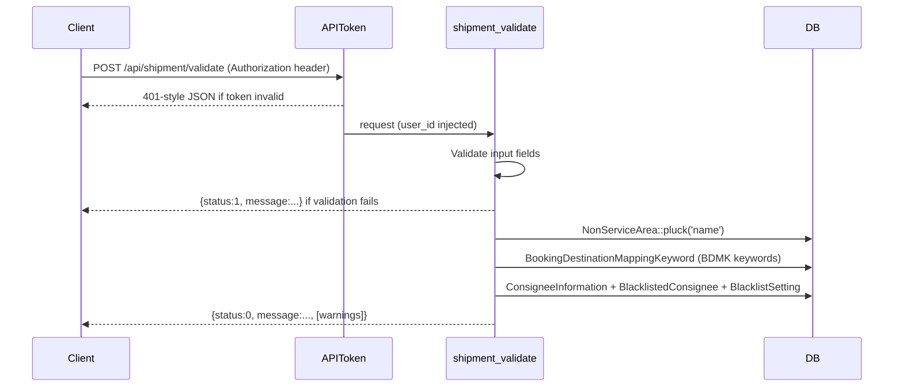

# Design Document: Pre-Booking Consignee Validation

## Overview

This feature adds a lightweight, read-only endpoint `POST /api/shipment/validate` to the existing Laravel API. It allows shippers to run the same consignee warning checks that happen inside `shipment_book` — non-service area (NSA), blacklisted consignee, and booking destination mapping keyword (BDMK) — without creating any shipment record or triggering any side effects.

The endpoint is a pure extraction of the warning logic already present in `APIController@shipment_book`. No new models, migrations, or external services are required.

## Architecture

The new endpoint sits entirely within the existing `APIToken` middleware group in `routes/api.php`, alongside the existing `shipment/book` route. It delegates to a new method `APIController@shipment_validate` in the same controller.

```
POST /api/shipment/validate
  └── Middleware: APIToken (Authorization header → injects user_id)
  └── Controller: APIController@shipment_validate
        ├── Input validation (Validator)
        ├── NSA check  (NonServiceArea::pluck)
        ├── BDMK check (BookingDestinationMappingKeyword + check_bdmk)
        ├── Blacklist check (ConsigneeInformation + BlacklistedConsignee + BlacklistSetting)
        └── Response assembly (status 0, optional warning fields)
```



## Components and Interfaces

### Route Registration

Inside the existing `Route::middleware('APIToken')->group(...)` block in `routes/api.php`, add inside the `Route::prefix('shipment')` group:

```php
Route::post('validate', 'APIController@shipment_validate')->name('validate');
```

### Controller Method: `APIController@shipment_validate`

**Inputs** (from `Request`):

| Field | Type | Rules |
|---|---|---|
| `consignee_city_id` | integer | required, integer, exists:cities,id |
| `consignee_name` | string | required, between:1,100 |
| `consignee_address` | string | required, between:1,255 |
| `consignee_phone_number_1` | string | required, custom phone_number rule |

**Phone number validation** reuses the same conditional logic from `shipment_book`:
- If the value starts with `92` or `03` → validate against `/^((\+92)|(92)|(0092))-{0,1}\d{10}$|^03\d{9}$/` (after normalisation via `APIController::phone_number()`)
- Otherwise → validate that the normalised value matches `/^\d+$/`

**Warning checks** (read-only, no writes):

1. **NSA**: `NonServiceArea::pluck('name')` → tokenise `consignee_address` by spaces/commas → case-insensitive match
2. **BDMK**: `BookingDestinationMappingKeyword` join → `$this->check_bdmk($city_id, $address, $keywords, $city_name)`
3. **Blacklist**: `ConsigneeInformation::where('phone', $phone)` → `BlacklistedConsignee` → `BlacklistSetting->message`

**Response shape**:

```json
// No warnings
{"status": 0, "message": "Consignee validated successfully"}

// With warnings (any combination)
{
  "status": 0,
  "message": "Consignee validated with warnings",
  "non_service_area": "A Possible Address Anomaly: ... Detected! ...",
  "blacklisted_consignee": "...",
  "bdmk_message": "..."
}

// Validation error
{"status": 1, "message": "Error(s) in Input", "errors": {...}}
```

### Reused Models (read-only)

| Model | Usage |
|---|---|
| `NonServiceArea` | `pluck('name')` — NSA keyword list |
| `ConsigneeInformation` | `where('phone', ...)` — phone lookup |
| `BlacklistedConsignee` | `where('consignee_information_id', ...)` — blacklist check |
| `BlacklistSetting` | `find($id)->message` — warning message |
| `BookingDestinationMappingKeyword` | join with `booking_destination_mappings` — BDMK keywords |
| `City` | `find($city_id)` — city name for BDMK message |

### Reused Methods

| Method | Usage |
|---|---|
| `APIController::phone_number($value)` | Normalises phone number before validation |
| `$this->check_bdmk($city_id, $address, $keywords, $city_name)` | BDMK conflict detection |

## Data Models

No new models or migrations are required. All data is read from existing tables:

- `non_service_areas` — NSA keyword list
- `consignee_informations` — phone number → consignee identity
- `blacklisted_consignees` — consignee identity → blacklist entry
- `blacklist_settings` — blacklist entry → warning message
- `booking_destination_mapping_keywords` — BDMK keywords
- `booking_destination_mappings` — BDMK city mappings
- `cities` — city name lookup

## Correctness Properties

*A property is a characteristic or behavior that should hold true across all valid executions of a system — essentially, a formal statement about what the system should do. Properties serve as the bridge between human-readable specifications and machine-verifiable correctness guarantees.*

### Property 1: No side effects

*For any* valid input to the validation endpoint, the total count of rows in the `shipments` table (and all other write tables) SHALL be identical before and after the request.

**Validates: Requirements 1.5**

---

### Property 2: Required field rejection

*For any* request that omits at least one of `consignee_city_id`, `consignee_name`, `consignee_address`, or `consignee_phone_number_1`, the response SHALL have `status` 1 and a `message` that identifies the missing field(s).

**Validates: Requirements 1.3, 1.4**

---

### Property 3: NSA keyword detection

*For any* consignee address that contains at least one token (split by spaces/commas) that case-insensitively matches a configured NSA keyword, the response SHALL include a `non_service_area` field whose value contains the matched keyword(s) and the standard advisory message. Conversely, for any address containing no NSA keyword tokens, the `non_service_area` field SHALL be absent from the response.

**Validates: Requirements 2.1, 2.2, 2.3**

---

### Property 4: Blacklist detection

*For any* phone number that resolves to a `ConsigneeInformation` record with an associated `BlacklistedConsignee` entry and a configured `BlacklistSetting` message, the response SHALL include a `blacklisted_consignee` field containing that message. For any phone number with no such association, the `blacklisted_consignee` field SHALL be absent.

**Validates: Requirements 3.1, 3.2, 3.3**

---

### Property 5: BDMK conflict detection

*For any* `(consignee_city_id, consignee_address)` pair where `check_bdmk` returns an `invalid_cities` result, the response SHALL include a `bdmk_message` field. For any pair where `check_bdmk` returns no conflict, the `bdmk_message` field SHALL be absent.

**Validates: Requirements 4.1, 4.2, 4.3**

---

### Property 6: Status is always 0 for valid requests

*For any* request that passes input validation (all required fields present and correctly formatted), the response SHALL always have `status` 0, regardless of how many warnings are present.

**Validates: Requirements 5.2, 5.3**

---

### Property 7: Phone number format validation

*For any* phone number string that begins with `92` or `03`, the validation SHALL apply the Pakistani mobile pattern; for any string that does not begin with `92` or `03`, the validation SHALL require digits only. In either case, a string that fails the applicable pattern SHALL produce a `status` 1 response.

**Validates: Requirements 6.1, 6.2, 6.3**

## Error Handling

| Scenario | Response |
|---|---|
| Missing `Authorization` header | `{status:1, message:"API Token (Authorization) is Missing."}` (from `APIToken` middleware) |
| Invalid API token | `{status:1, message:"Invalid API Token (Authorization)."}` (from `APIToken` middleware) |
| Missing/invalid required field | `{status:1, message:"Error(s) in Input", errors:{...}}` |
| Invalid phone number format | `{status:1, message:"Error(s) in Input", errors:{consignee_phone_number_1:[...]}}` |
| Valid request, no warnings | `{status:0, message:"Consignee validated successfully"}` |
| Valid request, one or more warnings | `{status:0, message:"Consignee validated with warnings", ...warningFields}` |

No exceptions are expected from the read-only DB queries under normal operation. If a `City` record is not found for the given `consignee_city_id`, the `exists:cities,id` validation rule will reject the request before the warning checks run.

## Testing Strategy

### Unit / Example-Based Tests

- Verify that a request without an `Authorization` header returns `status` 1 (middleware smoke test).
- Verify that a fully valid request with a clean consignee returns exactly `{"status":0,"message":"Consignee validated successfully"}`.
- Verify that each required field, when omitted individually, produces a `status` 1 response naming that field.
- Verify that a phone number with a non-Pakistani prefix (e.g. a plain digit string) passes the digits-only rule.

### Property-Based Tests

Use a PHP property-based testing library (e.g. [eris](https://github.com/giorgiosironi/eris) or a custom generator harness) with a minimum of **100 iterations per property**.

Each test must be tagged with a comment in the format:
`// Feature: pre-booking-consignee-validation, Property N: <property text>`

| Property | Generator strategy |
|---|---|
| P1 — No side effects | Generate random valid consignee inputs; assert `shipments` count unchanged |
| P2 — Required field rejection | Generate random subsets of required fields (at least one missing); assert `status` 1 |
| P3 — NSA detection | Generate addresses by randomly inserting/omitting NSA keywords; assert `non_service_area` present iff keyword present |
| P4 — Blacklist detection | Generate phone numbers from a seeded set of blacklisted/clean numbers; assert `blacklisted_consignee` present iff blacklisted |
| P5 — BDMK detection | Generate city/address pairs with/without BDMK keywords; assert `bdmk_message` present iff conflict |
| P6 — Status always 0 | Generate any valid input; assert `status` === 0 |
| P7 — Phone format | Generate phone strings with/without `92`/`03` prefix, valid and invalid; assert correct validation path |

Property tests should mock or use a test database seeded with known NSA keywords, blacklist entries, and BDMK mappings to keep tests deterministic and fast.
